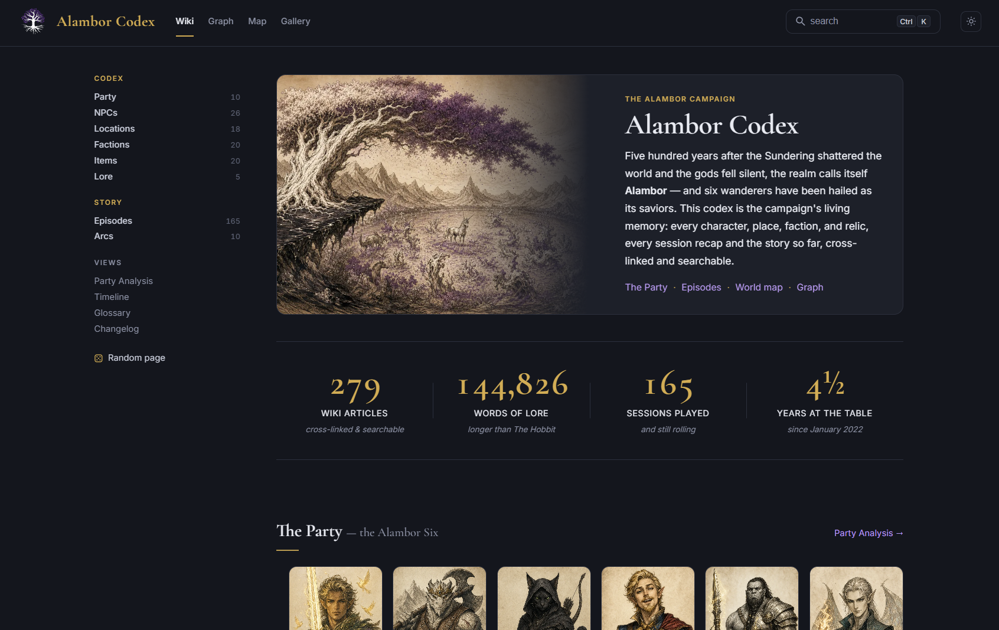
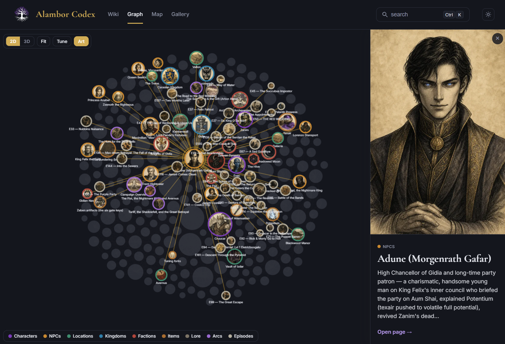
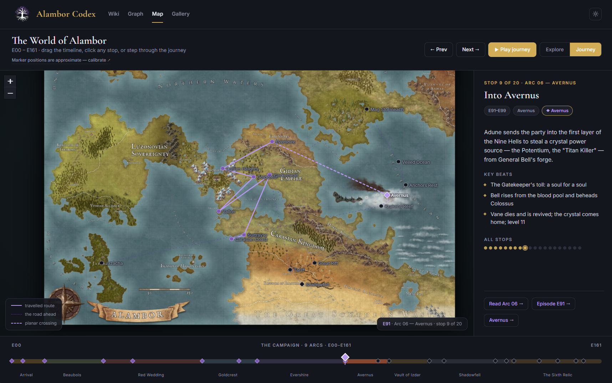
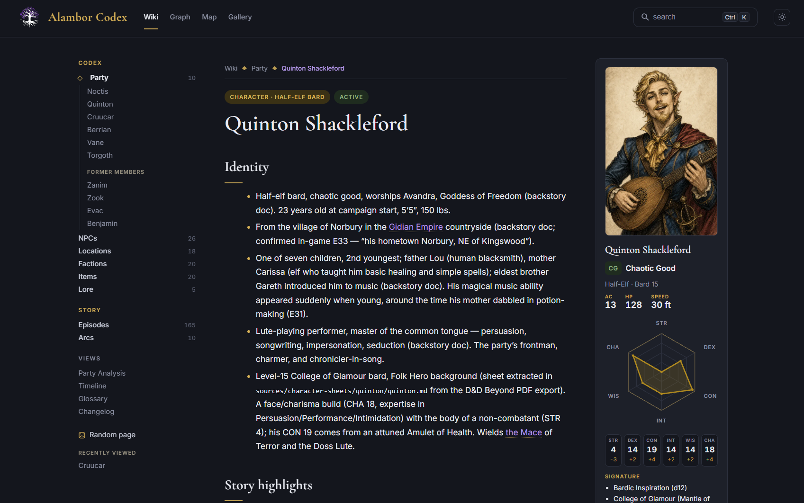

# Alambor Codex

A second brain for a long-running D&D 5e campaign: **166 episodes, 192 cross-linked wiki articles, 144,000+ words of lore** - built from real session recordings and rendered as a static wiki.

### 🌐 **[Explore the live wiki → alambor.vercel.app](https://alambor.vercel.app)**



Five hundred years after the Sundering shattered the world, six wanderers have been hailed as its saviors. This repo is the campaign's living memory: every character, place, faction, and relic, every session recap and the story so far - ingested, structured, and searchable.

## What's inside

The project has three layers:

1. **Sources** - the raw record: multi-track Discord session recordings transcribed per-speaker with Whisper, alongside the party's shared adventure log and DM handouts. These raw inputs are kept **private and local-only** (they hold unedited table talk and the DM's unpublished prep), so they are not part of this public repo — only the derived layers below are.
2. **Canon** (`canon/`) - the derived knowledge base. Structured episode recaps, entity dossiers (characters, NPCs, locations, factions, items), chapter arcs, a timeline, and a glossary that resolves every alias and misspelling to one canonical entity.
3. **Site** (`site/`) - an Astro static site that renders canon as a wiki with full-text search (Pagefind), an entity graph, an interactive world map, and AI-generated episode art.

The whole pipeline runs on Claude Code agents using the skills in `.claude/skills/`: **ingest-episode** turns a raw multi-speaker transcript into a structured episode article (scene-segmented, attributed by character, cross-checked against the DM's opening recap), **new-episode** scaffolds and enriches entity dossiers as the story grows, **generate-art** produces episode scene art from the canon, and **draft-newsletter** compiles a weekly recap newsletter for the players with links back into the wiki.

## The wiki

### Entity graph

Every character, NPC, location, faction, item, and episode as a force-directed graph (2D and 3D), linked by co-occurrence across the campaign.



### Interactive world map

The world of Alambor as a zoomable atlas: 44 pinned places organized by kingdom, with journey mode for tracing the party's travels.



### Character dossiers & party analysis

Each party member gets a dossier compiled from every episode they appear in: identity evidence, story highlights, stat blocks with ability radars, and signature moves - plus a party-wide analysis view.



Also in there: per-episode recaps with loot and combat tracking, chapter-level story arcs, a timeline, a glossary of every entity alias, an art gallery, and a changelog.

## Running it

```bash
cd site
npm install
npm run dev   # http://localhost:4321
```

The wiki builds entirely from the markdown in `canon/` - no database, no backend.

## License & content rights

- **Code** (the site, scripts, pipeline, and skills) is licensed under the [MIT License](LICENSE), copyright Phil Cheesman.
- **The campaign itself is not mine to license.** The Alambor world, story, characters, and all narrative content are the creative work of **Jon Zwier, our Dungeon Master**, and remain his copyright, all rights reserved. Campaign text and derived art appear here with his permission. If you fork this project, take the code and pipeline - bring your own campaign.

Built for the Alambor Six, with thanks to Jon for four and a half years (and counting) at the table.
